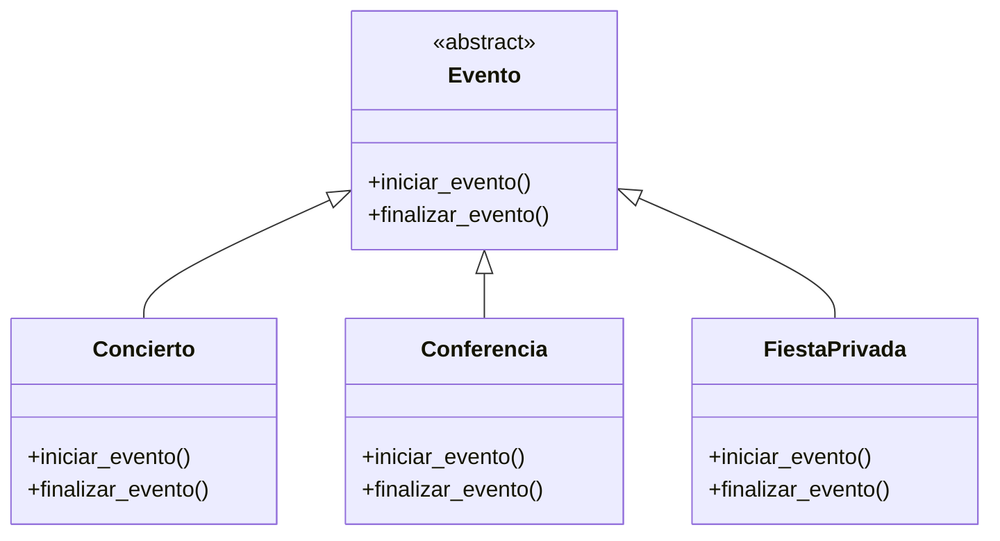
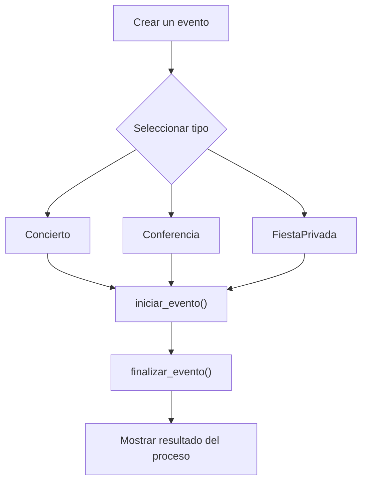

# Caso 7 - Empresa de eventos

## Diagrama UML

## Proceso

## Explicacion

`Evento` es una clase abstracta que define el comportamiento comun del sistema mediante los metodos `iniciar_evento()` y `finalizar_evento()`.

Las clases hijas (`Concierto`, `Conferencia`, `FiestaPrivada`) heredan de `Evento` y pueden especializar esos metodos para representar eventos con organizacion, duracion y cierre diferentes. Esto aplica el principio de herencia y permite tratar todos los objetos como `Evento` sin perder el comportamiento particular de cada tipo.
