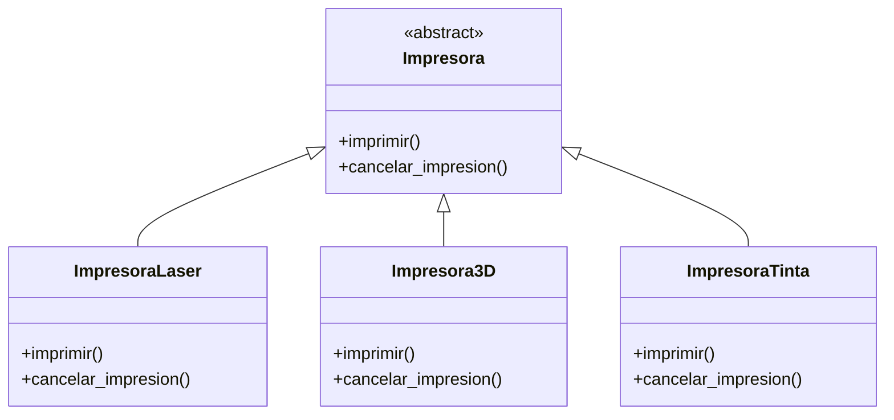
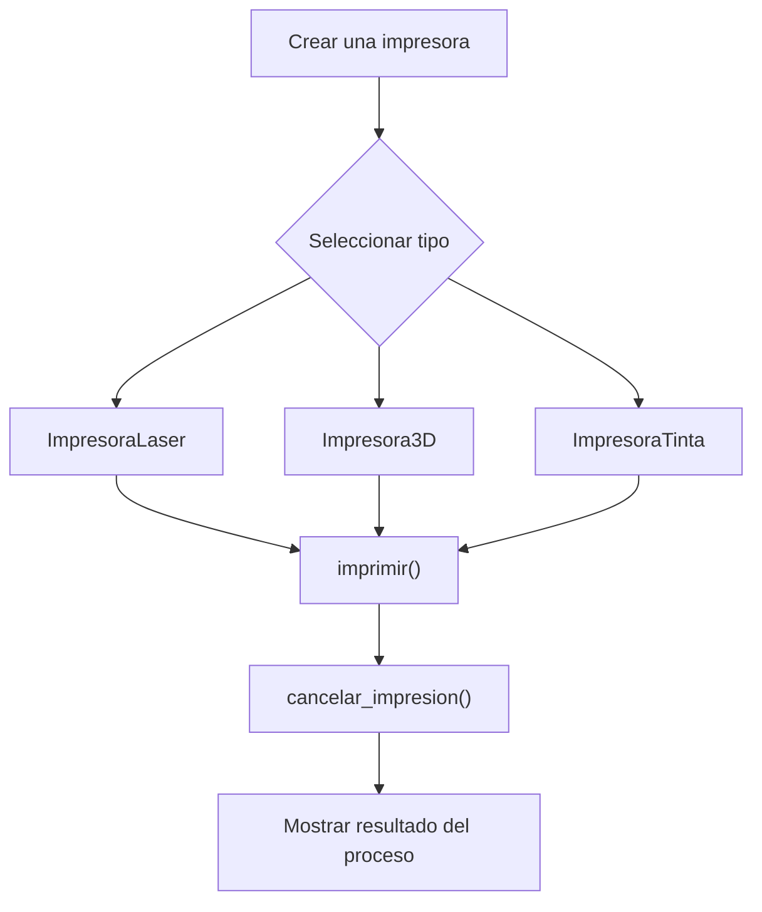

# Caso 8 - Sistema de impresion

## Diagrama UML

## Proceso

## Explicacion

`Impresora` es una clase abstracta que define el comportamiento comun del sistema mediante los metodos `imprimir()` y `cancelar_impresion()`.

Las clases hijas (`ImpresoraLaser`, `Impresora3D`, `ImpresoraTinta`) heredan de `Impresora` y pueden especializar esos metodos para representar impresoras con tecnologias y procesos de impresion diferentes. Esto aplica el principio de herencia y permite tratar todos los objetos como `Impresora` sin perder el comportamiento particular de cada tipo.
