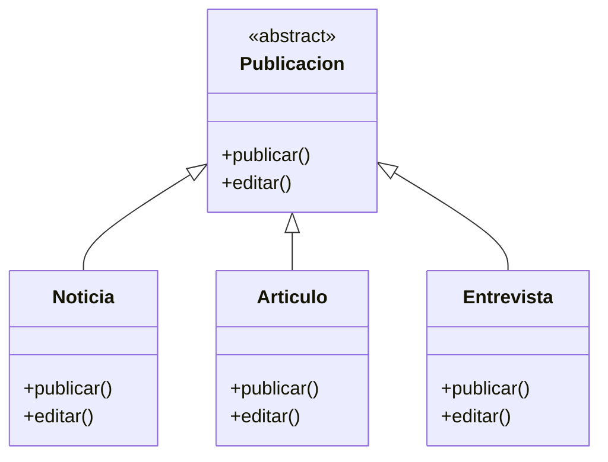
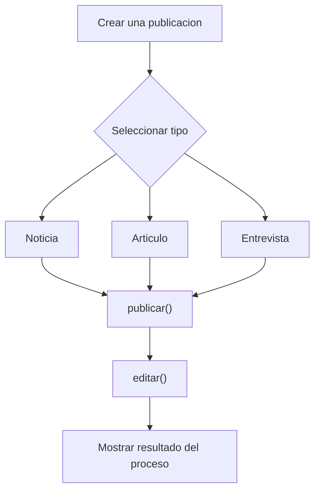

# Caso 9 - Plataforma de noticias

## Diagrama UML

## Proceso

## Explicacion

`Publicacion` es una clase abstracta que define el comportamiento comun del sistema mediante los metodos `publicar()` y `editar()`.

Las clases hijas (`Noticia`, `Articulo`, `Entrevista`) heredan de `Publicacion` y pueden especializar esos metodos para representar contenidos editoriales con estructura y revision diferentes. Esto aplica el principio de herencia y permite tratar todos los objetos como `Publicacion` sin perder el comportamiento particular de cada tipo.
