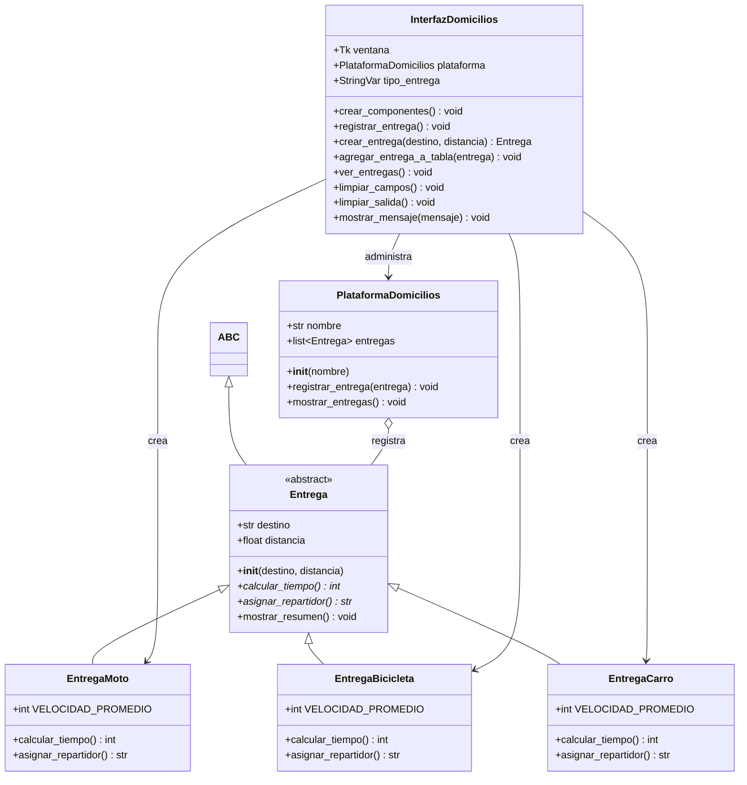
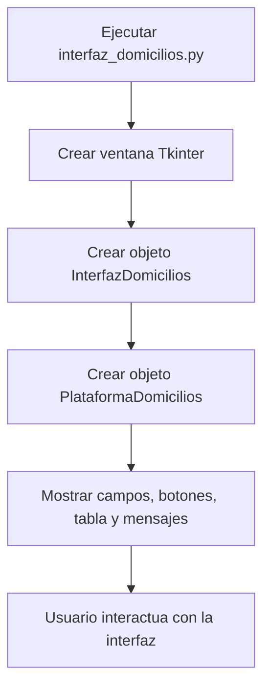
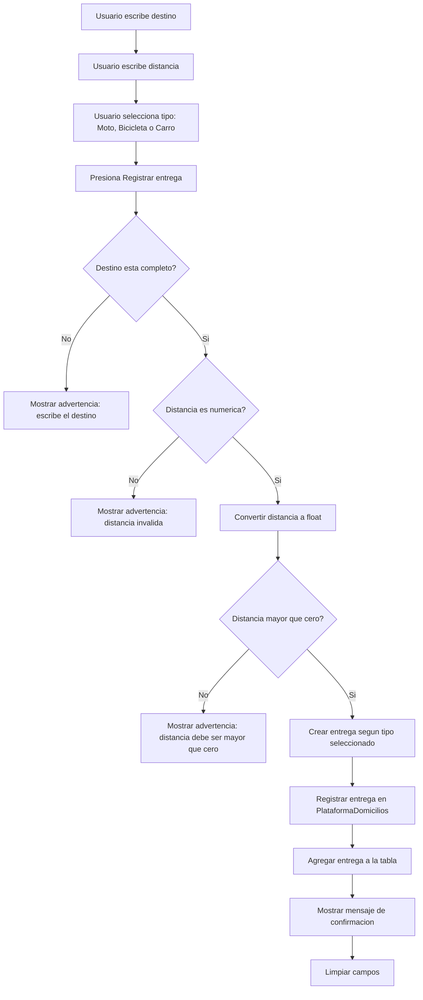
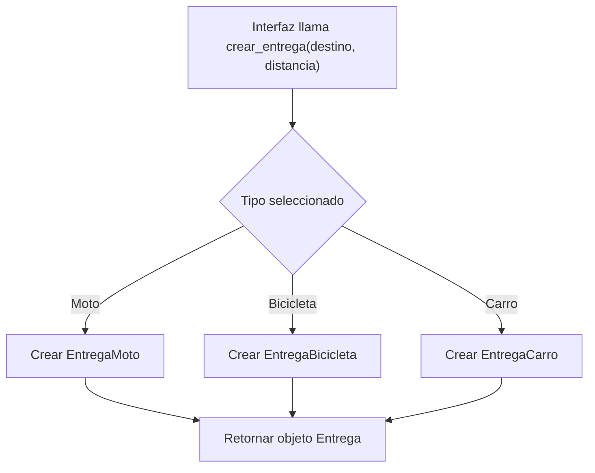
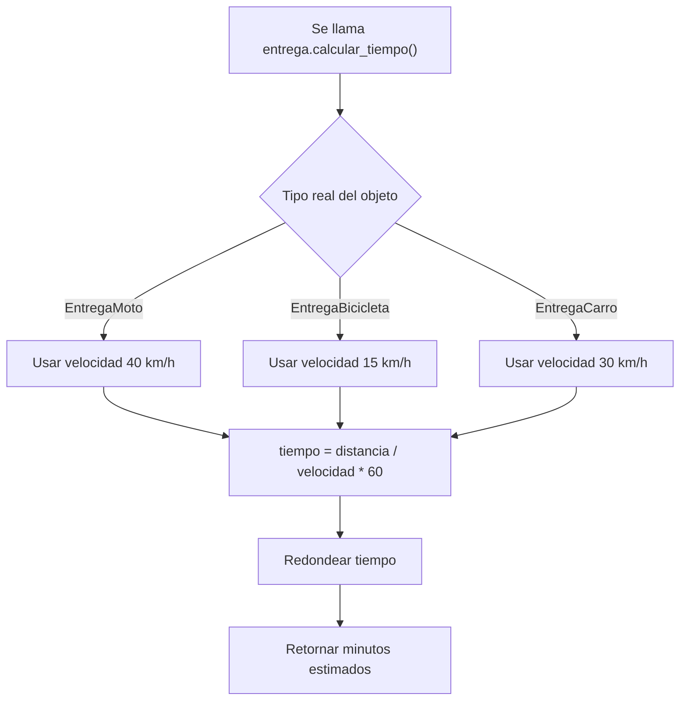
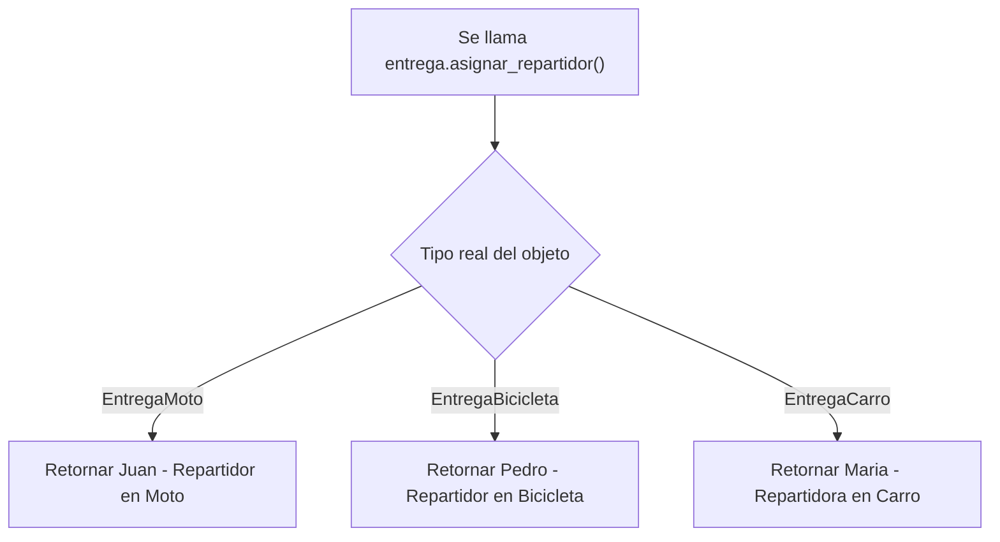
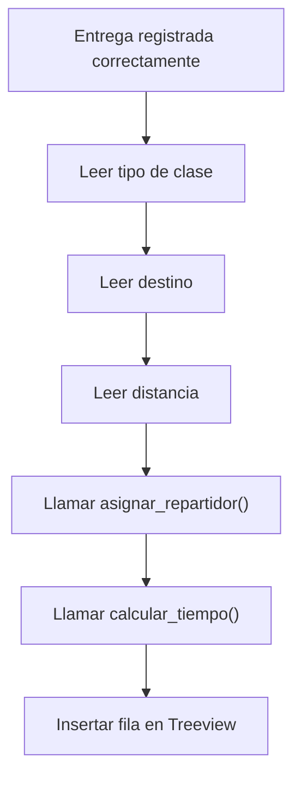
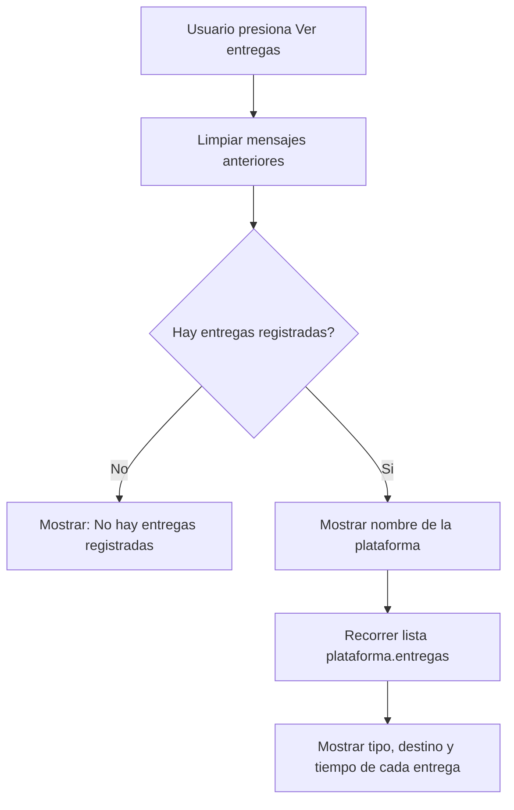
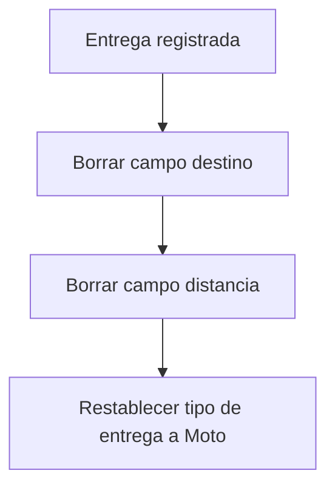

# Diagrama UML y procesos - Plataforma de Domicilios

Este documento explica la estructura del programa de domicilios y los procesos principales de la interfaz grafica.

## 1. Diagrama UML de clases

### Explicacion del UML

- `Entrega` es una clase abstracta: define lo que toda entrega debe tener.
- `EntregaMoto`, `EntregaBicicleta` y `EntregaCarro` heredan de `Entrega`.
- Cada tipo de entrega implementa `calcular_tiempo()` y `asignar_repartidor()`.
- `PlataformaDomicilios` guarda una lista de entregas.
- `InterfazDomicilios` usa la plataforma y crea objetos segun lo que seleccione el usuario.

## 2. Proceso general del programa

### Explicacion

El archivo `interfaz_domicilios.py` inicia la ventana. Dentro de esa ventana se crea una instancia de `PlataformaDomicilios`, que sera la encargada de guardar todas las entregas.

## 3. Proceso para registrar una entrega

### Explicacion

La interfaz valida los datos antes de crear el objeto. Si todo es correcto, crea una entrega concreta y la guarda en la plataforma.

## 4. Proceso para crear el objeto de entrega

### Explicacion

Aqui se aplica polimorfismo. La interfaz puede trabajar con cualquier objeto que herede de `Entrega`, sin importar si realmente es moto, bicicleta o carro.

## 5. Proceso para calcular tiempo

### Explicacion

Todos los tipos de entrega tienen el metodo `calcular_tiempo()`, pero cada clase usa una velocidad diferente. Por eso el resultado cambia segun el transporte.

## 6. Proceso para asignar repartidor

### Explicacion

Este proceso tambien demuestra polimorfismo. El mismo metodo devuelve un repartidor distinto dependiendo de la clase del objeto.

## 7. Proceso para agregar entrega a la tabla

### Explicacion

La tabla muestra datos que vienen directamente del objeto creado. Para completar la fila, llama metodos del objeto como `asignar_repartidor()` y `calcular_tiempo()`.

## 8. Proceso para ver entregas registradas

### Explicacion

La plataforma guarda todas las entregas en una lista. Al presionar `Ver entregas`, la interfaz recorre esa lista y muestra un resumen textual.

## 9. Proceso para limpiar campos

### Explicacion

Despues de registrar una entrega, la interfaz limpia los campos para que el usuario pueda ingresar otra entrega rapidamente.

## 10. Conceptos POO usados

| Concepto | Donde aparece | Explicacion |
| --- | --- | --- |
| Clase | `EntregaMoto`, `EntregaBicicleta`, `EntregaCarro` | Molde para crear entregas. |
| Objeto | `EntregaMoto(destino, distancia)` | Entrega concreta creada desde una clase. |
| Atributo | `destino`, `distancia`, `entregas` | Dato guardado dentro de un objeto. |
| Metodo | `calcular_tiempo()` | Accion que pertenece a una clase. |
| Herencia | `EntregaMoto(Entrega)` | Una clase hija reutiliza estructura de la clase padre. |
| Abstraccion | `Entrega(ABC)` | Define una plantilla obligatoria para todas las entregas. |
| Polimorfismo | `calcular_tiempo()` y `asignar_repartidor()` | El mismo metodo cambia su resultado segun el tipo de entrega. |
| Encapsulamiento | `self.destino`, `self.plataforma` | Los datos se organizan dentro del objeto que los usa. |
| Composicion | `PlataformaDomicilios` contiene entregas | Un objeto administra una lista de otros objetos. |
